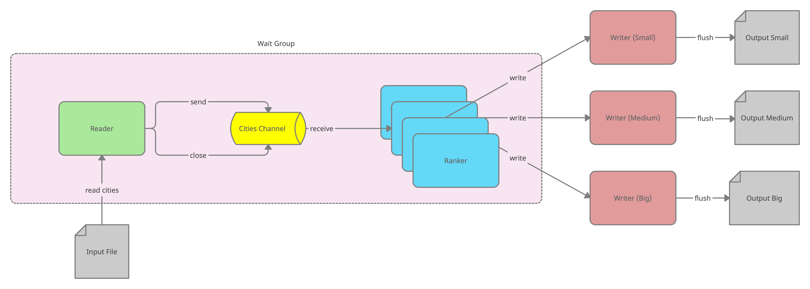

# city-ranker-pipeline

I wrote this small program to learn how to use Goroutines. 

### What does it do

The program reads an input file with a bunch of city names and their population, and creates three output files (small/medium/big), that contain the respective cities sorted by their population. The cities in the output files are sorted from the most to the least populous.

### How it works

- **Reader** reads the given `input_file.txt` line-by-line and sends the raw input to `Cities Channel`. Reader closes the channel when there are no more items to read.
- **Cities Channel** - unbuffered typed channel that servers as a pipe between the `Reader` and the `Rankers`.
- **Rankers** - multiple instances of `Ranker` read from the `Cities Channel` and run an "expensive ranking logic". That's why it makes sense to parallelize the rankers, so that whatever ranker is ready next picks up the next item from the `Cities Channel`.
- **Wait Group** - workers touching the `Cities Channel` = `Reader` + all `Rankers`. All workers must call `waitGroup.Done()` when they're finished with their work. 
- **Writers** - static set of writers that hold buffered lists of scored cities. The writers release their buffers to files on calling `flush`. The file names are `outputSmall.txt, outputMedium.txt, outputBig.txt`. The pipeline automatically cleans the old results on the next run.

The pipeline's entry point is [cmd/mapper/parallel_mapper.go](cmd/mapper/parallel_mapper.go), but every pipeline component has a corresponding test.

There's a bigger [integration test](city_ranking_pipeline_integration_test.go) that tests the entire pipeline as well.

### Running tests

`$ go test -v`

### Building & running locally

`$ cd cmd/mapper && go build && ./mapper`